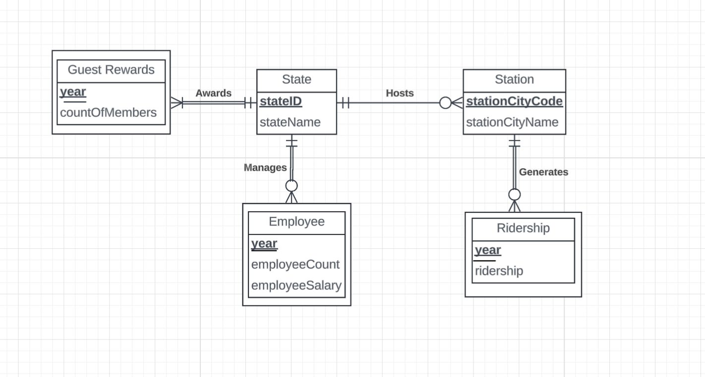
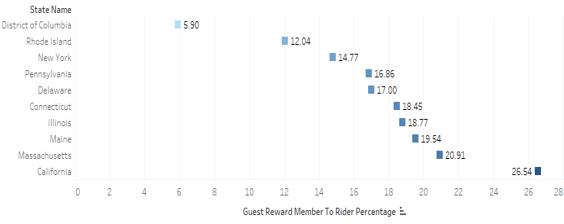
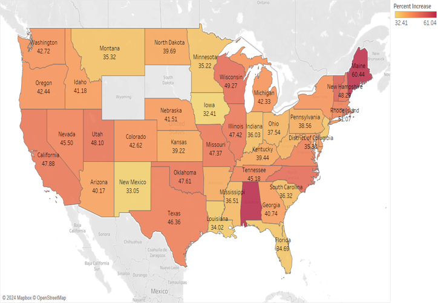
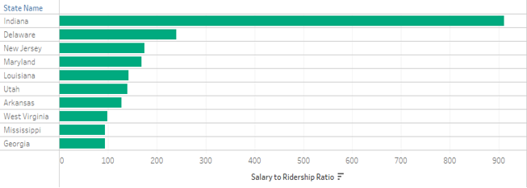

# Amtrak-SQL-Project

SQL database project analyzing Amtrak customer and employee metrics across U.S. states.  
We modeled ridership data, created a normalized schema, and then generated insights on guest reward memberships, employee salary efficiency, and state-wise trends.

---

## Table of Contents

1. [Project Overview](#project-overview)  
2. [Data Source & Preparation](#data-source--preparation)  
3. [Entity-Relationship Diagram (ERD)](#entity-relationship-diagram-erd)  
4. [Repository Structure](#repository-structure)  
5. [Setup & Usage](#setup--usage)  
6. [Visual Insights (Screenshots)](#visual-insights-screenshots)  
7. [Key Findings](#key-findings)  
8. [Note on Table Names with `$`](#note-on-table-names-with)  
9. [Technologies Used](#technologies-used)  
10. [Credits](#credits)

---

## Project Overview

This project models Amtrak data—**ridership**, **Guest Rewards**, **stations**, and **employees**—to analyze:
- Conversions from regular riders into Guest Rewards members  
- Efficiency of employee salary spending compared to ridership volume  
- Regional differences across U.S. states  

**Goal**: Help decision-makers see where Amtrak can better allocate staff and improve loyalty programs.

---

## Data Source & Preparation

1. **Amtrak Data**:  
   - We gathered and merged data from real Amtrak stats and supplementary info (state codes, city codes).
   - Reformatted into a single Excel file: `Amtrack.xlsx`.

2. **Schema Design**:  
   - We created a normalized schema with 5 main tables: `State`, `Station`, `Ridership`, `Employee`, `GuestRewards`.
   - Used **primary/foreign keys** and cascading referential integrity rules.

3. **Import to SQL**:  
   - Imported `Amtrack.xlsx` into SQL Server, which appended `$` to sheet-based tables.
   - You can rename them if you like (see [Note on Table Names](#note-on-table-names-with)).

---

## Entity-Relationship Diagram (ERD)

Here’s a visual representation of the final schema design:



- **State**: Primary key is `stateID`.  
- **Station**: Tied to a single `stateID`.  
- **Ridership**: Contains passenger counts by `stationCityCode` and `year`.  
- **Employee**: Contains staffing info by `stateID` and `year`.  
- **GuestRewards**: Tracks loyalty program membership counts by `stateID` and `year`.  

---

## Repository Structure

Amtrak-SQL-Project/
├── Data/
│   └── Amtrack.xlsx             # Our curated Excel data
├── SQL/
│   ├── create_tables.sql        # DDL: CREATE TABLE statements
│   └── insert_data.sql          # DML: Sample insert statements
├── Screenshots/
│   ├── ERD.png                  # The ERD image shown above
│   ├── guest_rewards_lowest.png
│   ├── guest_rewards_growth_map.png
│   └── salary_to_ridership_ratio.png
└── README.md


1. **Data/**: The structured Excel file (`Amtrack.xlsx`).  
2. **SQL/**: Two main scripts for building and populating the database.  
3. **Screenshots/**: Contains the ERD image and 3 key visualization screenshots.  
4. **README.md**: Project documentation and instructions.

---

## Setup & Usage

1. **Clone or Download** this repository  
   - Click the green “Code” button → “Download ZIP,” or  
   - `git clone https://github.com/YOUR-USERNAME/Amtrak-SQL-Project.git`

2. **Create Tables**  
   - Open `SQL/create_tables.sql` in your SQL environment (SQL Server, Azure Data Studio, etc.).  
   - Run the statements to build 5 tables: `State`, `Station`, `Ridership`, `Employee`, `GuestRewards`.

3. **Insert Data**  
   - **Option A**: Run `SQL/insert_data.sql` for sample entries.  
   - **Option B**: Import `Data/Amtrack.xlsx` directly into your database if you want the full data as-is.

4. **Write Your Own Queries**  
   - Explore ridership, membership growth, and employee salaries.  
   - Example: “Where are we over-staffed given ridership volume?”

5. **(Optional) Tableau Visualization**  
   - Connect Tableau to the same database for creating maps, bar charts, etc.  
   - Our screenshots below illustrate possible dashboards.

---

## Visual Insights (Screenshots)

Below are 3 key dashboards we built in Tableau (not including the `.twb` here, but you can recreate if needed).

### 1. States with the Lowest Guest Rewards Enrollment



*Despite high ridership in states like California and New York, Guest Rewards enrollment remains low. This indicates a need for stronger marketing or outreach to convert regular riders into loyalty members.*

### 2. Growth in Guest Rewards Membership (2021–2023)



*States like Maine and Georgia show the highest growth, potentially reflecting successful promotions or improved service. Underperforming states might replicate these strategies to boost membership.*

### 3. Salary-to-Ridership Ratio by State



*Indiana stands out with a disproportionate salary-to-rider ratio, suggesting potential overstaffing or high payroll relative to ridership.*

---

## Key Findings

1. **Under-Converted High-Ridership States**  
   - New York, California have large ridership but relatively low Guest Rewards enrollment.

2. **High Growth States** (e.g., Maine, Georgia)  
   - Rapid membership growth, likely driven by strong local marketing or improved routes.

3. **Salary Efficiency Gaps**  
   - Certain states (like Indiana) have extremely high salary outlays per rider, pointing to a possible mismatch in resource allocation.

---

## Note on Table Names with `$`

When data is imported from Excel, SQL Server appends a `$` to sheet-based tables (e.g., `GuestRewards$`). This is not an error.

```sql
SELECT * INTO GuestRewards FROM [GuestRewards$];
DROP TABLE [GuestRewards$];
```

## Technologies Used

- **SQL Server** (T-SQL)
- **Excel** (data cleaning & formatting)
- **Tableau** (visualization, optional)
- **GitHub** (version control)

## Credits

- **Team**: Dhwani Muni, Yancy Longin, Danielle Anane, Ashwin Balaji
- **Data**: Merged from real Amtrak references and custom Excel formatting
- **Purpose**: Showcases database design, SQL analysis, and data insights for real-world operations

**Thank you for checking out this project!**
